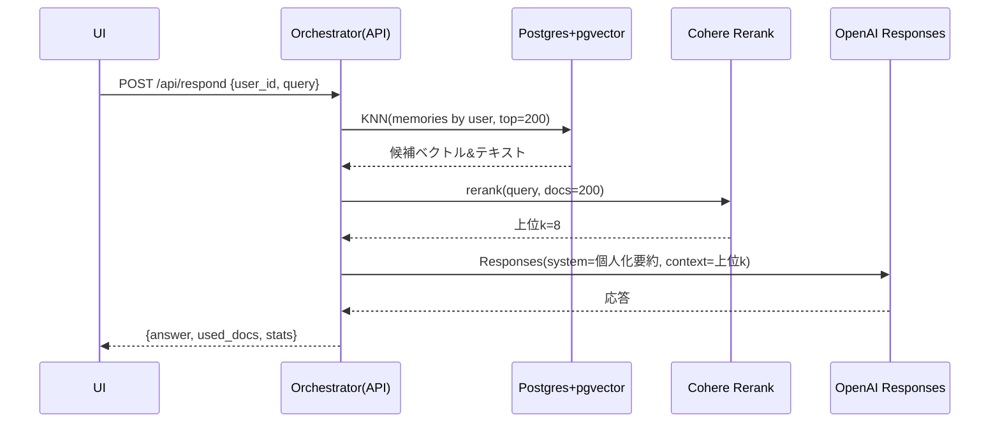

# Trait Flow MVP: アーキテクチャ設計（v0.1）

## 結論
- フロントエンド（Vite/TS）は現状維持。新規に **Orchestrator（FastAPI + LangGraph）** を追加し、短期/長期/方針メモリの管理と RAG→Rerank→LLM を一括実行する。
- 検索は Postgres + **pgvector**、候補は **Cohere Rerank v2** で上位 k を抽出、最終応答は **OpenAI Responses API**（将来は Realtime 拡張）で生成する。

## 前提
- 本リポジトリは UI プロトタイプ（Vite/TS）。Cloud Run で静的配信し、API は別オリジン（Orchestrator）へ CORS でアクセスする。Nginx 側の proxy 設定は不要。

## コスト観（概算）
- DB: Cloud SQL for Postgres（pgvector 有効化済み）。
- 推論: OpenAI Responses（トークン従量）＋ Cohere Rerank（クエリ数×候補数）。Rerank で上位 k に絞り、LLM 入力トークンを削減して総コストを抑える。

---

## 全体アーキテクチャ

```mermaid
flowchart LR
  subgraph FE[UI: trait-flow-mvp (Vite/TS)]
    U[ユーザー]
  end
  U -->|/api/respond, /api/memory/update| ORC[(Orchestrator: FastAPI + LangGraph)]
  subgraph DB[(Cloud SQL: Postgres + pgvector)]
    MEM[memories: KNN対象]
    UM[user_memory: long_term/policy]
  end
  ORC -->|KNN| MEM
  ORC -->|長期/方針 RW| UM
  ORC -->|Rerank| RR[Cohere Rerank v2]
  RR --> ORC --> LLM[OpenAI Responses / (将来) Realtime]
  ORC --> OBS[Logs / Metrics / Traces]
  ORC <-->|Webhook| N8N[n8n: CRM/通知/Sheets]
```

- LangGraph: ノード（処理）とエッジ（遷移）で状態付きフローを厳密管理でき、再入/リトライやストリーミングにも強い。  
- LlamaIndex: Query Transform、Router などの補助フローで検索精度を底上げ。  
- pgvector: 初期は Exact（距離演算）で再現性を確保し、p95 遅延が増えたら HNSW/IVFFlat へ移行。

## シーケンス（質問→個人化応答）



## データモデル（pgvector）

```sql
CREATE EXTENSION IF NOT EXISTS vector;

CREATE TABLE user_memory (
  user_id TEXT PRIMARY KEY,
  long_term VECTOR(3072),         -- text-embedding-3-large 等
  policy    VECTOR(128),          -- 嗜好・口調ベクトル
  last_updated TIMESTAMP DEFAULT now()
);

CREATE TABLE memories (
  id BIGSERIAL PRIMARY KEY,
  user_id TEXT NOT NULL,
  kind TEXT CHECK (kind IN ('short','long','note','trait')),
  embedding VECTOR(3072) NOT NULL,
  text TEXT NOT NULL,
  created_at TIMESTAMP DEFAULT now()
);

-- ANN インデックスは段階的に導入
-- CREATE INDEX memories_hnsw ON memories USING hnsw (embedding vector_l2_ops);
```

> メモ: HNSW/IVFFlat は構築時間・メモリとレイテンシのトレードオフを考慮し、まず Exact で運用してから必要に応じて移行する。

## API（最小）

| Endpoint | 概要 |
| --- | --- |
| `POST /api/memory/update` | ユーザー回答を保存 → 埋め込み → `memories` へ挿入。`user_memory.long_term` を EMA 更新し、`policy` ベクトルを更新。 |
| `POST /api/respond` | KNN (top=200) → Cohere Rerank (top=8) → 個人化 system を付与した OpenAI Responses で応答。`{ answer, used_docs, stats }` を返却。 |

## 非機能要件（NFR）

| 指標 | 目標値 | 根拠 |
| --- | --- | --- |
| P95 レイテンシ | ≤ 900 ms | KNN ≤ 300ms + Rerank ≤ 200ms + LLM ≤ 400ms |
| 失敗率 | < 1% | リトライ / フォールバック |
| 可用性 | 99.9% | Cloud Run + Cloud SQL の冗長構成 |

監視 KPI: p95、RPS、4xx/5xx、KNN 候補数、Rerank 呼数、LLM トークン、ユーザー満足度（★1–5）  
アラート例: p95 > 1.5s（3 分継続） / 5xx > 1%（1 分継続）

## セキュリティ / プライバシー
- 取得データを最小化し、目的限定で利用。鍵は Secret Manager 管理。必要な列は暗号化・マスキング。  
- Realtime（音声）拡張時は通知・保存期間・国外移転などの情報を開示。

## 参考リンク
- LangGraph: Graph API / Thinking in LangGraph / Overview  
- LlamaIndex: Query Transform / Advanced Retrieval  
- pgvector: README / HNSW / IVFFlat 解説  
- Cohere Rerank v2: API / v2 リリースノート  
- OpenAI Responses & Realtime: 公式ドキュメント・移行ガイド
