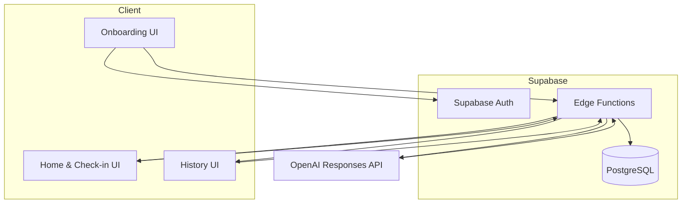
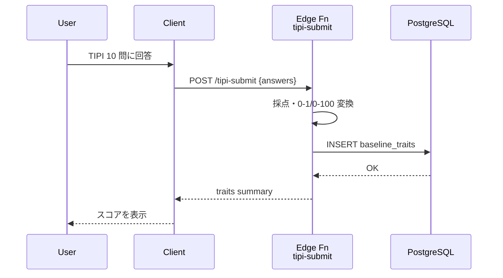
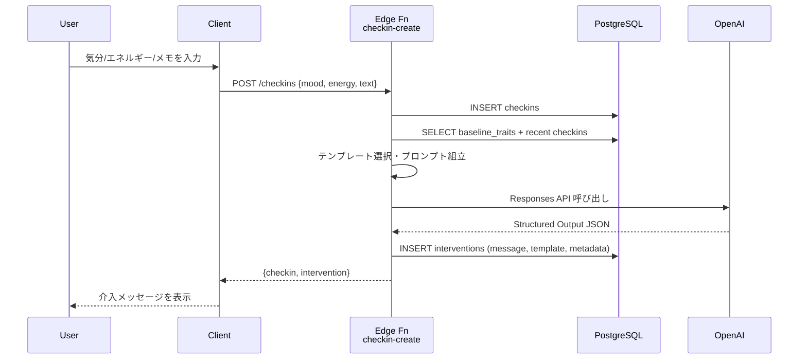
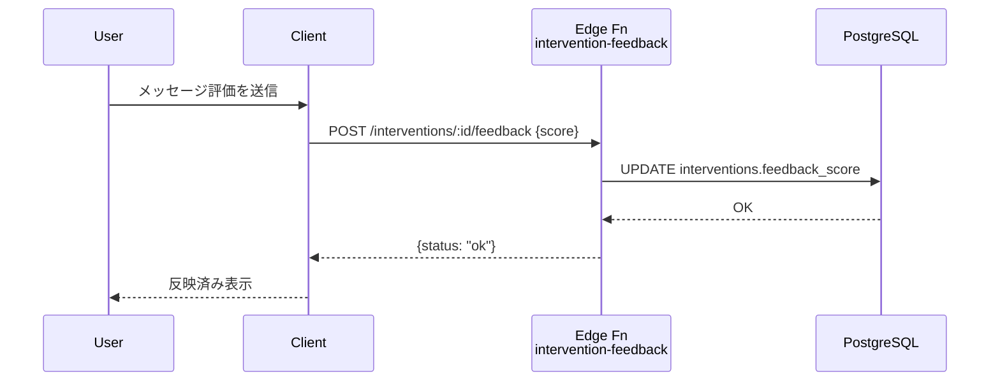

# アーキテクチャ概要

## 1. コンポーネント構成
- **Web クライアント (Next.js / React)**  
  - ページ: オンボーディング、ホーム、チェックイン、履歴、設定。  
  - 認証: Supabase Auth（メールリンクまたは OTP）。  
  - データ取得: Supabase JS SDK を通じた REST/Edge Functions 呼び出し。
- **Supabase バックエンド**
  - **PostgreSQL**: `baseline_traits` / `checkins` / `interventions` / `users` テーブルを管理。Row Level Security (RLS) でユーザー単位にアクセス制御。
  - **Edge Functions (Deno)**: 業務ロジックを実装。TIPI 保存、チェックイン登録、介入生成、フィードバック更新などを担当。
  - **Storage**（オプション）: 将来的な添付ファイルやエクスポートに備えた領域。現時点では未使用。
- **OpenAI Responses API**
  - モデル: `gpt-4.1-mini`  
  - Structured Output Schema に従い、介入メッセージを生成。フォールバック時はテンプレートを返す。
- **Monitoring / Analytics**
  - Supabase Logs: Edge Functions の成功/失敗、レスポンス時間を確認。  
  - Slack Webhook（任意）: 重大エラー通知。  
  - OpenAI Usage Dashboard: API 消費量を日次で確認。

## 2. High-Level データフロー

## 3. ユースケース別シーケンス

### 3.1 オンボーディング（TIPI）

### 3.2 日次チェックインと介入生成

### 3.3 フィードバック送信

## 4. セキュリティと権限
- Supabase Auth が発行する JWT をクライアントが保持し、Edge Functions は `Authorization: Bearer` トークンを検証。
- 各テーブルに RLS を設定し、`auth.uid()` が `user_id` と一致する行のみ `SELECT/INSERT/UPDATE` を許可。
- Edge Functions はサービスロール鍵で DB にアクセスし、リクエストペイロードと `user_id` を明示的にバリデーション。
- OpenAI API キーは Edge Functions の環境変数 (`OPENAI_API_KEY`) として保持し、クライアントへ露出しない。

## 5. 環境構成
- **ローカル開発**
  - Supabase CLI → `supabase start` で Postgres + Auth + Functions 環境を起動。
  - `.env.local` に Supabase URL / anon key、OpenAI API キーを設定。
  - フロントエンドは `next dev`、Edge Functions は `supabase functions serve` でホットリロード。
- **ステージング / 本番**
  - Supabase プロジェクトを 1 つ作成し、ステージング・本番はブランチで管理。  
  - Edge Functions は GitHub Actions 経由で `supabase functions deploy <name>` を実行。  
  - OpenAI API キーや Slack Webhook は Supabase のプロジェクトシークレットに保存。

## 6. 依存関係
- Next.js 14 / React 18 / TypeScript
- Supabase JS SDK (`@supabase/supabase-js`)
- UI コンポーネントライブラリ（例: Chakra UI or Tailwind + Headless UI）
- zod（バリデーション）
- OpenAI SDK (`openai` npm), もしくは fetch 呼び出し
- date-fns（日付処理）

## 7. 可観測性と運用
- Edge Functions のログを日次で確認し、エラー率やレスポンス時間を記録。  
- OpenAI Usage を監視し、想定コストと乖離した場合はテンプレートのみ配信に切り替える。  
- 重要イベント（例: OpenAI 呼び出し失敗率 > 10%）は Slack へ通知する関数を用意。  
- 週次で `checkins` / `interventions` の件数をエクスポートし、パイロット運用の継続判断材料とする。
