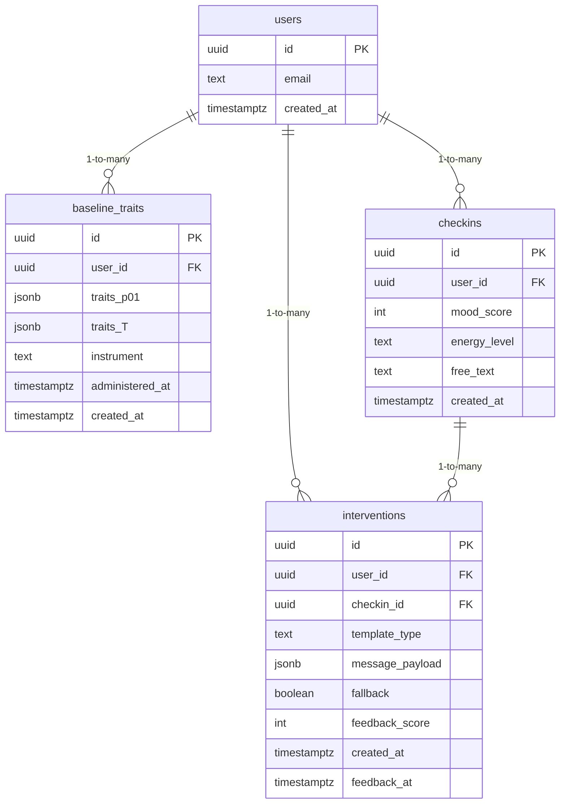

# データモデル詳細

## 1. テーブル一覧
| テーブル | 目的 | 主なフィールド |
|----------|------|----------------|
| `users` | Supabase Auth ユーザー情報を拡張 | `id`, `email`, `created_at` |
| `baseline_traits` | TIPI による初期 Big Five スコア | `traits_p01`, `traits_T`, `instrument`, `administered_at` |
| `checkins` | 日次チェックイン記録 | `mood_score`, `energy_level`, `free_text`, `created_at` |
| `interventions` | 介入メッセージと評価 | `template_type`, `message_payload`, `feedback_score`, `fallback` |

## 2. ER 図


## 3. DDL 定義
```sql
create table public.users (
  id uuid primary key default auth.uid(),
  email text,
  created_at timestamptz default now()
);

create table public.baseline_traits (
  id uuid primary key default gen_random_uuid(),
  user_id uuid references public.users(id) on delete cascade,
  traits_p01 jsonb not null check (
    traits_p01 ? 'O' and traits_p01 ? 'C' and traits_p01 ? 'E'
    and traits_p01 ? 'A' and traits_p01 ? 'N'
  ),
  traits_T jsonb not null check (
    traits_T ? 'O' and traits_T ? 'C' and traits_T ? 'E'
    and traits_T ? 'A' and traits_T ? 'N'
  ),
  instrument text not null default 'tipi_v1',
  administered_at timestamptz not null,
  created_at timestamptz default now()
);

create table public.checkins (
  id uuid primary key default gen_random_uuid(),
  user_id uuid references public.users(id) on delete cascade,
  mood_score int not null check (mood_score between 1 and 5),
  energy_level text not null check (energy_level in ('low','mid','high')),
  free_text text,
  constraint free_text_length check (char_length(coalesce(free_text, '')) <= 280),
  created_at timestamptz default now()
);

create table public.interventions (
  id uuid primary key default gen_random_uuid(),
  user_id uuid references public.users(id) on delete cascade,
  checkin_id uuid references public.checkins(id) on delete cascade,
  template_type text not null check (template_type in ('reflection','action','compassion')),
  message_payload jsonb not null,
  fallback boolean default false,
  feedback_score int,
  created_at timestamptz default now(),
  feedback_at timestamptz
);
```

## 4. JSON カラム仕様
- `traits_p01` / `traits_T`: `{ "O": 0.62, "C": 0.48, ... }` 形式。  
- `message_payload`: 
  - 永続化例
  ```json
  {
    "title": "今日の振り返り",
    "body": "昨日より少し落ち着いているようですね…",
    "cta_text": "3分だけ深呼吸する",
    "prompt_trace": {
      "template": "reflection",
      "inputs": {
        "top_trait": "O",
        "recent_mood_avg": 3.1
      },
      "version": "1.0.0"
    }
  }
  ```

## 5. インデックス / パーティショニング
- `checkins` / `interventions` は `user_id` + `created_at` の組み合わせで索引を追加。
  ```sql
  create index on public.checkins (user_id, created_at desc);
  create index on public.interventions (user_id, created_at desc);
  ```
- パーティショニングは不要（データ量が小さい想定）。将来的に 10 万件以上になった場合、月単位でパーティション化を検討。

## 6. Row Level Security (RLS)
```sql
alter table public.baseline_traits enable row level security;
alter table public.checkins enable row level security;
alter table public.interventions enable row level security;

create policy "traits by owner" on public.baseline_traits
  for select using (auth.uid() = user_id)
  with check (auth.uid() = user_id);

create policy "checkins by owner" on public.checkins
  for select using (auth.uid() = user_id)
  with check (auth.uid() = user_id);

create policy "interventions by owner" on public.interventions
  for select using (auth.uid() = user_id)
  with check (auth.uid() = user_id);
```
Edge Functions はサービスロール (`supabaseServiceRole`) で挿入・更新を行うため、RLS 制約をバイパスできる。

## 7. マイグレーション運用
- Supabase CLI の `supabase migration new init_schema` で初期 DDL を作成し、Git で管理。
- 新規フィールド追加時は `supabase migration new add_feedback_at` などで差分を管理。
- ローカル開発では `supabase db reset` でマイグレーションを反映。

## 8. データ保持・アーカイブ方針
- パイロット期間中は全件保持（削除しない）。  
- 90 日以上経過した `checkins` / `interventions` は、必要に応じて `archive_` テーブルへコピーし、ダッシュボード用に集計。  
- ユーザー削除時は Supabase Auth により `users` レコードが削除され、CASCADE により下位データも削除される。
