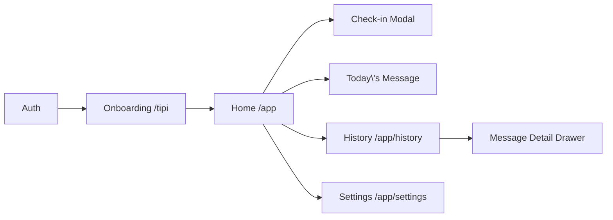

# フロントエンド設計

Next.js + React + TypeScript を前提とした UI/UX 設計をまとめる。

## 1. ナビゲーション構造

- `/` : ランディング（パイロット参加案内、サインアップ CTA）
- `/app` : 認証済みエリア。`AppLayout` が Supabase セッションを検証し、未ログインは `/login` へリダイレクト。

## 2. ページ別 UI 概要

### 2.1 オンボーディング (`/app/onboarding`)
- **Step 1: ウェルカム**
  - TIPI の説明、「全 10 問・約 3 分」と所要時間を表示。
- **Step 2: TIPI 質問フォーム**
  - 10 問を 2 ページに分割（5 問ずつ）。Likert 7 段階のラジオボタン。
  - `次へ` ボタンは全問回答で活性化。
- **Step 3: 結果表示**
  - レーダーチャート or バーで 5 特性 (0〜100) を表示。
  - 「今は簡易スコアです。日次チェックインでより深いフィードバックを得られます」と説明。
  - `ホームへ進む` CTA。

### 2.2 ホーム (`/app`)
- ヘッダー: ユーザー名、メニューボタン。
- セクション:
  1. 今日のメッセージカード（直近介入。未取得なら「チェックインしてみましょう」）。
  2. 「今日の調子は？」カード → `Check-in` ボタンでモーダルを開く。
  3. 連続チェックイン日数、平均評価を表示するボトム統計バー。

### 2.3 チェックインモーダル
- フォーム項目
  - 気分スライダー: 1〜5 を表情アイコン付きで表示。
  - エネルギーレベル: `low` / `mid` / `high` の 3 ボタン。
  - テキストエリア（任意、最大 280 文字）。
- 送信アクション
  - `POST /functions/v1/checkins` をコールし、レスポンスを待つ間はローディングスピナー。
  - 成功時: 介入メッセージをモーダル内で表示し、`OK` で閉じる。
  - 失敗時: トーストで通知し、フォールバックメッセージを表示。

### 2.4 履歴 (`/app/history`)
- タブ切り替え: `チェックイン`, `メッセージ`
- **チェックインタブ**
  - 日付、気分スコア（バッジ）、エネルギー、テキスト抜粋をリスト表示。
  - 無限スクロール（`GET /checkins` + `next_offset`）。
- **メッセージタブ**
  - 各介入カードをリスト。`CTA` をタグ表示（例: `3分呼吸`）。
  - 評価済みなら星アイコン、未評価なら「役に立った？」CTA。
- 詳細表示は右側からスライドする Drawer で `message.body` を全文表示。

### 2.5 設定 (`/app/settings`)
- メールアドレス表示、ログアウトボタン。
- データ削除申請フォーム（メールリンク）。
- パイロットに関する注意書き、問い合わせ先。

## 3. コンポーネント構成

| コンポーネント | 概要 |
|----------------|------|
| `AppLayout` | 認証チェック、共通ヘッダー/フッター |
| `TipiForm` | 10 問をページング表示、ステップ管理 |
| `TraitRadarChart` | D3/Recharts などでレーダーチャート描画 |
| `CheckinModal` | フォーム + 結果表示を内包 |
| `InterventionCard` | タイトル/本文/CTA を持つカード。ホーム・履歴で再利用 |
| `FeedbackStars` | 1〜5 の評価 UI |
| `InfiniteList` | スクロールによるページネーション制御 |

## 4. 状態管理
- React Query (TanStack Query) を採用し、Supabase Edge Functions を `useQuery` / `useMutation` で呼び出す。
- キャッシュキー例:
  - `['traits']` : TIPI スコア
  - `['checkins', { offset }]` : チェックインリスト
  - `['interventions', { offset }]`
  - `['latest-intervention']` : ホームの最新メッセージ
- チェックイン投稿成功時は `invalidateQueries(['checkins'])` および `invalidateQueries(['latest-intervention'])` を実行。

## 5. UX ガイドライン
- **応答時間**: チェックイン送信からメッセージ表示まで 8 秒以内。タイムアウト 12 秒でフォールバック表示。
- **アクセシビリティ**: スライダーとボタンにキーボード操作/ARIA ラベルを付与。色覚バリアフリー（WCAG AA）。
- **ローカライズ**: 日本語のみ想定だが、文面は `i18n` コンフィグで分離し、将来の英語化に備える。
- **空状態**:
  - メッセージ履歴なし → チェックイン誘導のイラスト + CTA。
  - TIPI 未回答 → ホームで「まずは性格タイプを確認しましょう」カードを表示。

## 6. 通知 / リマインダー（任意）
- MVP ではアプリ内バナーのみ。Phase 2 で Slack/メール通知を検討。

## 7. スタイルガイド
- カラーパレット
  - Primary: `#4C6EF5`
  - Secondary: `#82C91E`
  - Neutral: `#1F2933` / `#E5E7EB`
- タイポグラフィ: `Noto Sans JP` / `Inter`
- コンポーネントテーマは Tailwind CSS をベースとし、`theme.ts` にトークン化。

## 8. エラー処理 & トースト
- 400 系: フォームバリデーションエラー → フィールド下にメッセージ。
- 401/403: セッション切れ → `supabase.auth.signOut()` しログインへ誘導。
- 500 系: トースト「サーバーで問題が発生しました。しばらくしてから再度お試しください。」を表示し、フォールバックメッセージがあれば合わせて案内。

## 9. テスト
- **Unit**: Form バリデーション、テンプレート選択表示、CTA ハンドラ。
- **Integration**: `msw` を使い Edge Functions をモック。チェックイン→介入表示までの流れをテスト。
- **E2E**: Playwright で TIPI 回答、チェックイン、履歴表示のシナリオを自動化。
