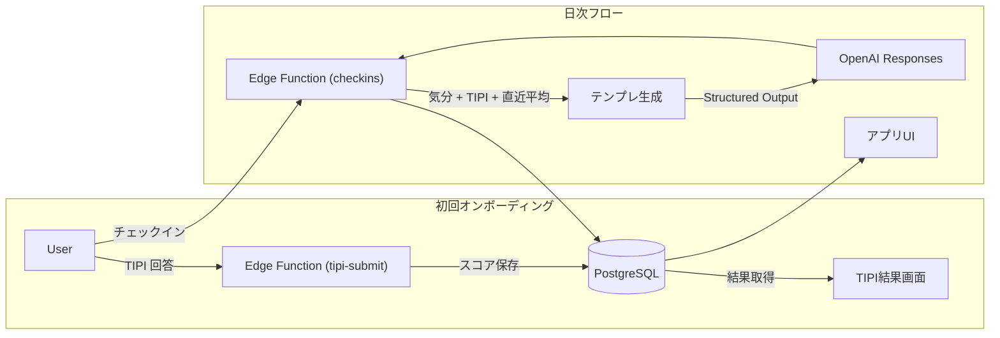

# Trait Flow プロトタイプ かんたん紹介

この資料は、開発チーム以外のメンバーやテストユーザーに向けて、プロトタイプの狙いと体験をシンプルに説明するためのサマリーです。

---

## 1. ひとことで言うと？
- **Trait Flow** は、「今日の気分」と「自分の性格タイプ」を手がかりに、毎日ちょっと役に立つ声かけをくれるパーソナルコーチ。
- プロトタイプでは「10 問の性格チェック（TIPI）」と「日次チェックイン」を組み合わせ、**たった 3 分の習慣で気づきを増やす**ことを目指します。

---

## 2. 1日の体験イメージ
```
⓪ 初回（サインアップ直後）：TIPI 10 問に回答 → スコアを確認し、使い方ガイドを読む
① 朝：アプリを開くと前日のひと言メッセージを確認
② 昼：その日の気分・エネルギーを 1 分で入力（任意でメモ）
③ すぐに：あなたの性格タイプと最近の調子を踏まえた提案が届く
④ 夜：届いた提案が役に立ったか 5 段階でフィードバック
⑤ 週末：履歴画面で自分の気分の波やメモを振り返る
```

---

## 3. どんな価値がある？
- **自分のパターンを客観視**：TIPI（Ten Item Personality Inventory）の結果と合わせて、気分や行動のクセを整理。
- **“次に何をすれば良いか” が明確**：気分が高いときは行動提案、低いときはセルフコンパッション、真ん中は振り返り質問を提示。
- **フィードバックがすぐ反映**：役に立った／立たなかったを記録し、次回の提案づくりに活かす。

---

## 4. ユーザーに見える画面
| 画面 | 目的 | ひとこと説明 |
|------|------|--------------|
| オンボーディング | 性格タイプを把握 | 10 問に答えると 5 大特性のレーダーチャートが表示（初回のみ） |
| ホーム | 今日の状態を更新 | 前回メッセージと「今日の調子」をチェックイン |
| チェックインモーダル | 気分の入力 | 気分スライダー + エネルギーのボタン + メモ欄 |
| 介入メッセージ | すぐにアドバイス | OpenAI が整形したタイトル＋本文＋CTA |
| 履歴 | 振り返り | チェックインとメッセージのログを一覧で確認 |

---

## 5. 裏側では何が起きている？

- バックエンドは Supabase（PostgreSQL + Edge Functions）で構築。
- OpenAI Responses API にテンプレートを渡してもらったアドバイスを生成。
- すべてのデータはユーザー本人だけが見られるようにアクセス制御。

---

## 6. 今後 8 週間のロードマップ（かんたん版）
| 週 | 進めること | 成果 |
|----|------------|------|
| Week 1 | 環境構築・TIPI UI ラフ | 動く画面の叩き台 |
| Week 2 | TIPI 実装・結果表示 | オンボーディング完了 |
| Week 3 | チェックイン + 介入生成 | アドバイスが返る状態 |
| Week 4 | 履歴・評価・メトリクス | 体験一通り完成 |
| Weeks 5-6 | 内部テスト・改善 | バグ潰し＆改善リスト |
| Weeks 7-8 | パイロット実施 | フィードバック収集 |

---

## 7. よくある質問（FAQ）
- **Q. なぜ TIPI なの？**  
  A. わずか 10 問で Big Five の傾向が分かるため、初回体験のハードルを下げる目的で採用しています。将来は IPIP-NEO などへの拡張を検討。

- **Q. メッセージは毎回 AI が考えている？**  
  A. 「テンプレート（行動 / 振り返り / セルフコンパッション）」をベースに、OpenAI がユーザーの状態に合わせて言い回しを整えます。もし失敗しても定型文でフォロー。

- **Q. データは安全？**  
  A. Supabase の Row Level Security で、本人以外が見られないように制御。OpenAI に送る内容も必要最小限。

- **Q. 将来の拡張は？**  
  A. Symanto API によるテキスト分析や、行動提案の高度化（バンディット）を別フェーズで予定しています。

---

## 8. 用語ミニ辞典
| 用語 | 意味 |
|------|------|
| TIPI | Ten Item Personality Inventory。性格を 10 問で推定する簡易テスト。 |
| チェックイン | その日の気分・エネルギー・ひと言メモを記録する機能。 |
| 介入メッセージ | AI が生成する今日の提案。タイトル・本文・CTA で構成。 |
| CTA | Call To Action の略。次に行う具体的な行動を示す。 |

---

## 9. こんな人に見せたい
- テスト参加予定のユーザー
- 事業サイドや経営層など、プロトを短時間で理解したいステークホルダー
- 将来の開発メンバー候補（採用時の説明資料として）

---

## 10. 連絡先・次の一歩
- パイロットに参加したい場合はプロダクトオーナー（naruse）まで。  
- 機能の改善アイデアは GitHub Issue か Slack #trait-flow に投稿してください。
