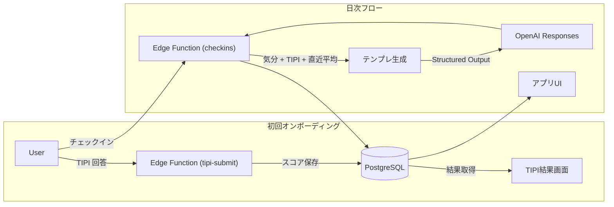

Trait Flow 仕様説明（やさしい言葉版）

目的
毎日少しだけ自分の気持ちを記録すると、その内容に合わせた「今日のひとことアドバイス」が返ってきます。これを続けることで、自分の気分の変化を知ったり、次の行動のヒントを得たりすることを目指します。

使いはじめの流れ（初回オンボーディング）

1. メールで登録したあと、10 問の性格クイズ（TIPI）に答えます。
2. アプリは回答を計算し、5 つの性格（外向的・まじめ・協調的など）の強さを図で見せてくれます。
3. この結果は「初期データ」として保存され、毎日のアドバイスづくりに使われます。

毎日の基本フロー

1. ホーム画面で「今日はどんな気分？」カードをタップします。
2. 気分（1〜5 のスライダー）、体の元気さ（低・中・高）、短いメモ（任意）を入力します。
3. 送信すると、すぐに「今日のアドバイスカード」が表示されます。
4. 夜になったら、そのカードが役に立ったか星 1〜5 で評価できます。
5. すべての記録は履歴画面でいつでも振り返ることができます。

アドバイスが決まる仕組み

- システムは最初の性格クイズ（TIPI）の結果と、最近 3 回分の気分スコアを読み取ります。
- 気分が高い時は「行動を促すカード」、低い時は「やさしい声かけカード」、真ん中なら「振り返りカード」を選びます。
- 選ばれたカードのひな形と、その日の記録をまとめて AI へ渡し、短い文章に整えてもらいます。
- AI の結果が使えない場合は、安全な定型文に切り替えます（この場合はカードに「テンプレート」と表示）。

# Trait Flow プロトタイプ かんたん紹介

この資料は、開発チーム以外のメンバーやテストユーザーに向けて、プロトタイプの狙いと体験をシンプルに説明するためのサマリーです。

---

## 1. ひとことで言うと？
- **Trait Flow** は、「今日の気分」と「自分の性格タイプ」を手がかりに、毎日ちょっと役に立つ声かけをくれるパーソナルコーチ。
- プロトタイプでは「10 問の性格チェック（TIPI）」と「日次チェックイン」を組み合わせ、**たった 3 分の習慣で気づきを増やす**ことを目指します。

---

## 2. 1日の体験イメージ
```
⓪ 初回（サインアップ直後）：TIPI 10 問に回答 → スコアを確認し、使い方ガイドを読む
① 朝：アプリを開くと前日のひと言メッセージを確認
② 昼：その日の気分・エネルギーを 1 分で入力（任意でメモ）
③ すぐに：あなたの性格タイプと最近の調子を踏まえた提案が届く
④ 夜：届いた提案が役に立ったか 5 段階でフィードバック
⑤ 週末：履歴画面で自分の気分の波やメモを振り返る
```

---

## 3. どんな価値がある？
- **自分のパターンを客観視**：TIPI（Ten Item Personality Inventory）の結果と合わせて、気分や行動のクセを整理。
- **“次に何をすれば良いか” が明確**：気分が高いときは行動提案、低いときはセルフコンパッション、真ん中は振り返り質問を提示。
- **フィードバックがすぐ反映**：役に立った／立たなかったを記録し、次回の提案づくりに活かす。

---

## 4. アプリの主な画面
アプリを構成する主要な画面の役割と、そこで見られる内容をまとめました。

| 画面の名前 | どんなことをする場所？ | 画面にあるもの |
|--------------|----------------------------|----------------------|
| 性格診断の結果画面 | 最初に答えた性格診断（TIPI）の結果を確認します。（初回のみ表示） | ● 5 つの性格の強さを示すグラフ<br>● 結果の詳しい解説テキスト<br>● ホーム画面へ進むボタン |
| ホーム画面 | アプリの入り口。最新のアドバイスを読んだり、今日の気分を記録したりします。 | ● 最新のアドバイスカード<br>● 「今日の気分は？」ボタン<br>● 継続利用日数やチェックイン回数 |
| チェックイン画面 | 今の気分や体調を 1 分で入力します。 | ● 気分スライダー（1〜5 段階）<br>● 体の元気さボタン（高・中・低）<br>● メモ欄（自由入力・任意）<br>● 送信ボタン |
| アドバイスカード画面 | 記録した内容をもとに、AI が作成したメッセージを読みます。 | ● アドバイスのタイトルと本文<br>● 関連する行動（CTA）の提案<br>● 役立ち度の評価（星 1〜5） |
| 履歴画面 | これまでの気分とアドバイスを振り返ります。 | ● 過去のチェックイン一覧<br>● これまでのアドバイスカード一覧 |

---

## 5. 裏側では何が起きている？

- バックエンドは Supabase（PostgreSQL + Edge Functions）で構築。
- OpenAI Responses API にテンプレートを渡してもらったアドバイスを生成。
- すべてのデータはユーザー本人だけが見られるようにアクセス制御。

---

## 6. ユーザーの 1 日の流れ（例）
あるユーザーが 1 日のあいだに Trait Flow をどう使うかを具体的に示します。

| 時間帯 🕒 | ユーザーのアクション 👋 | アプリの反応 ✨ |
|-------------|--------------------------------|----------------------------------------------|
| 朝 ☀️（8:00 ごろ） | アプリを開いて、前日に届いたアドバイスを読み返す。 | ホーム画面に最新のアドバイスカードを表示します。 |
| 昼 🕛（12:30 ごろ） | 「今日の気分は？」ボタンから、気分・体調・メモを入力して送信する。 | 1. 記録を安全に保存します。<br>2. AI があなたに合ったアドバイスを作成します。<br>3. すぐに新しいアドバイスカードを表示します。 |
| 夜 🌙（21:00 ごろ） | 昼にもらったアドバイスが役に立ったか、星（1〜5）で評価する。 | 評価を保存し、今後のアドバイスの参考にします。 |
| 週末 🗓️ | 履歴画面を開いて、「今週はどんな気分が多かったかな？」と振り返る。 | 保存されている過去の記録を一覧で表示します。 |

---

## 7. よくある質問（FAQ）
- **Q. なぜ TIPI なの？**  
  A. わずか 10 問で Big Five の傾向が分かるため、初回体験のハードルを下げる目的で採用しています。将来は IPIP-NEO などへの拡張を検討。

- **Q. メッセージは毎回 AI が考えている？**  
  A. 「テンプレート（行動 / 振り返り / セルフコンパッション）」をベースに、OpenAI がユーザーの状態に合わせて言い回しを整えます。もし失敗しても定型文でフォロー。

- **Q. データは安全？**  
  A. Supabase の Row Level Security で、本人以外が見られないように制御。OpenAI に送る内容も必要最小限。

- **Q. 将来の拡張は？**  
  A. Symanto API によるテキスト分析や、行動提案の高度化（バンディット）を別フェーズで予定しています。

---

## 8. 用語ミニ辞典
| 用語 | 意味 |
|------|------|
| TIPI | Ten Item Personality Inventory。性格を 10 問で推定する簡易テスト。 |
| チェックイン | その日の気分・エネルギー・ひと言メモを記録する機能。 |
| 介入メッセージ | AI が生成する今日の提案。タイトル・本文・CTA で構成。 |
| CTA | Call To Action の略。次に行う具体的な行動を示す。 |

---

## 9. こんな人に見せたい
- テスト参加予定のユーザー
- 事業サイドや経営層など、プロトを短時間で理解したいステークホルダー
- 将来の開発メンバー候補（採用時の説明資料として）

---

## 10. 連絡先・次の一歩
- パイロットに参加したい場合はプロダクトオーナー（naruse）まで。  
- 機能の改善アイデアは GitHub Issue か Slack #trait-flow に投稿してください。
