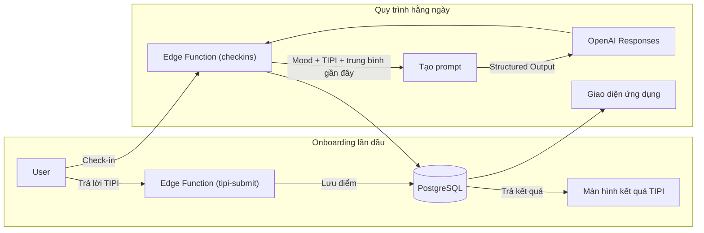

Trait Flow – Thuyết minh chức năng (dễ hiểu)

Mục tiêu
Mỗi ngày chỉ cần ghi lại cảm xúc của mình trong chốc lát, bạn sẽ nhận được một “lời nhắc nhở ngắn cho hôm nay” phù hợp với nội dung đó. Việc duy trì thói quen này giúp bạn nhận ra sự thay đổi cảm xúc và tìm ra gợi ý cho hành động tiếp theo.

Luồng bắt đầu sử dụng (onboarding lần đầu)

1. Đăng ký bằng email, sau đó trả lời 10 câu hỏi tính cách (TIPI).
2. Ứng dụng tính toán và hiển thị biểu đồ thể hiện mức độ của 5 nhóm tính cách (ví dụ: hướng ngoại, tận tâm, dễ hòa hợp...).
3. Kết quả này được lưu làm “dữ liệu ban đầu” và được dùng cho việc tạo thông điệp mỗi ngày.

Quy trình cơ bản hằng ngày

1. Tại trang chủ, chạm vào thẻ “Hôm nay thế nào?”
2. Nhập cảm xúc (thanh trượt 1–5), mức năng lượng (thấp/trung bình/cao) và ghi chú ngắn (tuỳ chọn).
3. Gửi đi là ứng dụng sẽ hiển thị ngay “thẻ thông điệp hôm nay”.
4. Buổi tối có thể đánh giá thẻ đó hữu ích mức nào bằng sao 1–5.
5. Mọi bản ghi đều có thể xem lại bất cứ lúc nào trong trang lịch sử.

Cách hệ thống quyết định thông điệp

- Hệ thống đọc kết quả TIPI ban đầu cùng với điểm cảm xúc của 3 lần gần nhất.
- Nếu cảm xúc cao, sẽ chọn “thẻ gợi ý hành động”; nếu thấp, chọn “thẻ động viên nhẹ nhàng”; nếu trung bình, chọn “thẻ gợi mở phản tư”.
- Mẫu thẻ đã chọn và bản ghi trong ngày được gửi tới AI để viết thành lời ngắn gọn.
- Nếu AI không trả về kết quả hợp lệ, hệ thống dùng thông điệp mẫu an toàn (thẻ sẽ hiển thị “template”).

# Trait Flow Prototype – Giới thiệu nhanh (Tiếng Việt)

Tài liệu này dùng để giải thích đơn giản mục tiêu và trải nghiệm của bản prototype cho những người không trực tiếp tham gia phát triển cũng như người dùng thử nghiệm.

---

## 1. Nói ngắn gọn thì đây là gì?
- **Trait Flow** là “huấn luyện viên cá nhân” gửi gợi ý nhỏ mỗi ngày, dựa trên **tâm trạng hôm nay** và **kiểu tính cách** của bạn.
- Prototype kết hợp “bài trắc nghiệm 10 câu TIPI” và “check-in hằng ngày”, hướng đến việc **tạo thói quen 3 phút mỗi ngày để gia tăng nhận thức**.

---

## 2. Một ngày trải nghiệm mẫu
```
⓪ Lần đầu (sau khi đăng ký): trả lời 10 câu TIPI → xem kết quả & hướng dẫn sử dụng
① Buổi sáng: mở ứng dụng và đọc lại thông điệp của ngày hôm trước
② Buổi trưa: ghi nhanh cảm xúc & mức năng lượng (có thể thêm ghi chú)
③ Ngay lập tức: nhận gợi ý dựa trên kiểu tính cách và trạng thái gần đây
④ Buổi tối: đánh giá gợi ý hữu ích đến mức nào (1–5 sao)
⑤ Cuối tuần: xem lại biểu đồ cảm xúc và ghi chú trong trang lịch sử
```

---

## 3. Giá trị mang lại
- **Nhìn lại khách quan thói quen của bản thân**: kết hợp kết quả TIPI với nhật ký cảm xúc để nhận ra các khuynh hướng.
- **Biết rõ “bước tiếp theo nên làm gì”**: tâm trạng cao → đề xuất hành động, tâm trạng thấp → chăm sóc bản thân, mức trung bình → câu hỏi gợi mở.
- **Phản hồi được tiếp thu ngay**: ghi nhận gợi ý hữu ích hay chưa để cải thiện những lần gửi tiếp theo.

---

## 4. Các màn hình chính của ứng dụng
Tổng hợp vai trò của từng màn hình và những thành phần xuất hiện trên màn hình đó.

| Tên màn hình | Dùng để làm gì? | Có những thành phần nào? |
|---------------|---------------------|--------------------------|
| Màn hình kết quả TIPI | Xem kết quả trắc nghiệm tính cách đã trả lời lúc bắt đầu (chỉ hiển thị lần đầu). | ● Biểu đồ thể hiện 5 nhóm tính cách mạnh/yếu<br>● Đoạn giải thích chi tiết kết quả<br>● Nút tiếp tục đến trang chủ |
| Trang chủ | Cửa ngõ của ứng dụng: đọc thông điệp mới nhất và bắt đầu check-in. | ● Thẻ thông điệp mới nhất<br>● Nút “Hôm nay thế nào?”<br>● Số ngày liên tục sử dụng hoặc số lần check-in |
| Màn hình check-in | Ghi lại cảm xúc và năng lượng hiện tại trong vòng 1 phút. | ● Thanh trượt cảm xúc (1–5)<br>● Các nút mức năng lượng (Cao / Trung bình / Thấp)<br>● Ô ghi chú tự do (không bắt buộc)<br>● Nút gửi |
| Thẻ thông điệp | Đọc thông điệp do AI soạn dựa trên dữ liệu bạn vừa nhập. | ● Tiêu đề và nội dung thông điệp<br>● Gợi ý hành động (CTA) liên quan<br>● Đánh giá mức hữu ích bằng sao (1–5) |
| Trang lịch sử | Xem lại các lần check-in và thông điệp trước đây. | ● Danh sách các lần check-in<br>● Danh sách thẻ thông điệp đã nhận |

---

## 5. Hậu trường hoạt động ra sao?

- Backend xây dựng bằng Supabase (PostgreSQL + Edge Functions).
- OpenAI Responses API tạo thông điệp dựa trên template.
- Quyền truy cập được kiểm soát để chỉ chính người dùng nhìn thấy dữ liệu của mình.

---

## 6. Ví dụ về hành trình một ngày của người dùng
Ví dụ một người dùng tương tác với Trait Flow trong suốt một ngày.

| Thời điểm 🕒 | Hành động của người dùng 👋 | Ứng dụng phản hồi như thế nào? ✨ |
|--------------|------------------------------------------|------------------------------------------------|
| Buổi sáng ☀️ (khoảng 8:00) | Mở ứng dụng, đọc lại thông điệp của ngày hôm trước. | Trang chủ hiển thị thẻ thông điệp mới nhất. |
| Buổi trưa 🕛 (khoảng 12:30) | Nhấn “Hôm nay thế nào?”, nhập cảm xúc, năng lượng và ghi chú rồi gửi. | 1. Lưu an toàn bản ghi mới.<br>2. AI tạo thông điệp phù hợp với bạn.<br>3. Hiển thị ngay thẻ thông điệp mới. |
| Buổi tối 🌙 (khoảng 21:00) | Đánh giá thông điệp lúc trưa có hữu ích không bằng sao (1–5). | Lưu điểm đánh giá để cải thiện thông điệp lần sau. |
| Cuối tuần 🗓️ | Mở trang lịch sử và xem “tuần này mình cảm thấy thế nào?”. | Hiển thị danh sách các bản ghi và thông điệp đã lưu. |

---

## 7. FAQ – Câu hỏi thường gặp
- **Hỏi: Vì sao chọn TIPI?**  
  Đáp: TIPI chỉ 10 câu nhưng cho thấy xu hướng Big Five, giúp hạ thấp rào cản ở lần dùng đầu. Sau này có thể mở rộng sang IPIP-NEO, v.v.

- **Hỏi: Mỗi thông điệp có phải do AI viết mới?**  
  Đáp: Có 3 template (hành động / phản tư / tự cảm thông). OpenAI điều chỉnh lời văn theo trạng thái người dùng; nếu lỗi sẽ dùng câu mẫu dự phòng.

- **Hỏi: Dữ liệu có an toàn không?**  
  Đáp: Supabase Row Level Security đảm bảo chỉ chủ nhân mới xem được dữ liệu. Thông tin gửi đến OpenAI cũng ở mức tối thiểu.

- **Hỏi: Kế hoạch phát triển tiếp theo?**  
  Đáp: Sẽ bổ sung phân tích văn bản bằng Symanto API và nâng cấp thuật toán gợi ý (ví dụ bandit) trong các giai đoạn sau.

---

## 8. Từ điển mini
| Thuật ngữ | Ý nghĩa |
|-----------|---------|
| TIPI | Ten Item Personality Inventory – Bài trắc nghiệm 10 câu về Big Five. |
| Check-in | Ghi lại cảm xúc, năng lượng và ghi chú ngắn trong ngày. |
| Thông điệp can thiệp | Gợi ý do AI tạo, gồm tiêu đề, nội dung và CTA. |
| CTA | Call To Action – Hành động cụ thể được khuyến nghị tiếp theo. |

---

## 9. Dành cho những ai?
- Người dùng dự kiến tham gia đợt pilot.
- Các bên liên quan (kinh doanh, lãnh đạo) cần hiểu nhanh về prototype.
- Ứng viên tiềm năng muốn tham gia phát triển sản phẩm.

---

## 10. Liên hệ & bước tiếp theo
- Nếu muốn tham gia pilot, vui lòng liên hệ Product Owner (naruse).  
- Ý tưởng cải tiến chức năng: tạo issue trên GitHub hoặc gửi vào Slack #trait-flow.
