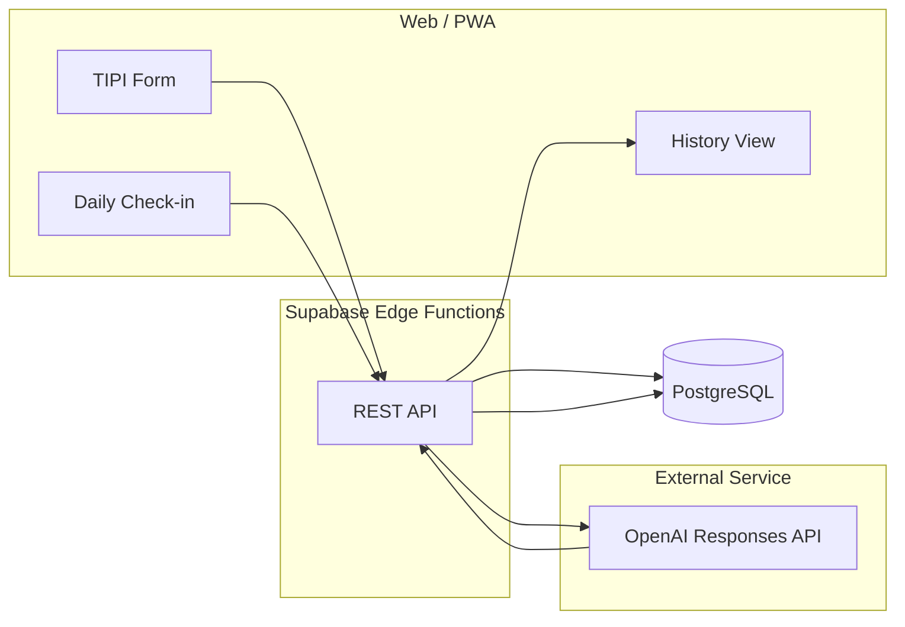

# Trait Flow MVP プロトタイプ仕様書（簡易版）

## 0. 背景
- `requirements_AI_assistant` で定義されたフル機能版を見据えつつ、価値検証とフィードバック収集を最短で行うための「スモールスタート版」。
- 数週間で 5〜10 名のテストユーザーに提供できることを優先し、実装コストが高いワークフロー（Symanto 連携・時系列解析・高度な信頼性制御）は段階的に導入する。
- 主要利用シナリオは日本語モバイル Web。バックエンドは Supabase（PostgreSQL + Edge Functions）を前提にするが、Firebase/Next API Routes でも代替可能。

## 1. 検証仮説と成功指標
- **検証仮説**
  1. 簡易 Big Five（10 問）と日次チェックインの組み合わせでも、ユーザーは「パーソナライズされた気付き」を感じる。
  2. 過去のチェックイン記録を踏まえた介入メッセージは、汎用的な提案よりも役に立つと評価される。
  3. OpenAI Responses API だけでも日次運用に耐えるレスポンスと安定性を確保できる。
- **成功指標（2 週間のパイロットを想定）**
  - オンボーディング完了率 ≥ 80%（10 問回答）
  - 日次チェックイン継続率 ≥ 50%（登録ユーザーの半数が 4 回以上投稿）
  - 介入メッセージの「役に立った」自己評価 ≥ 60%
  - システム稼働: OpenAI 呼び出し成功率 ≥ 97%、レスポンス時間中央値 < 5 秒

## 2. スコープ
### 実装する機能
- TIPI（Ten Item Personality Inventory）ベースの 10 問オンボーディングと即時スコア表示。
- 日次チェックイン：気分スライダー、エネルギーレベル、テキストメモ（任意）の 3 入力。
- シンプルな介入生成：テンプレート + ルールベースで文脈（TIPI スコア・直近 3 回の気分平均）を差し込み、OpenAI Responses API でリライト。
- 履歴画面：過去のチェックインとメッセージをリスト表示。
- 最小限のメトリクス：日次アクティブ数、連続投稿日数、メッセージ評価（5 段階）を Supabase 上で集計。

### スコープ外（今後の拡張）
- Symanto API による自動性格推定、ベイズ統合、EWMA/傾き算出。
- KPI ダッシュボード、A/B テスト、複雑なレコメンドロジック。
- 信頼性制御（サーキットブレーカ、レートリミット）や完全な監査ログ。
- 多言語対応、Push 通知、ネイティブアプリ。

## 3. ユーザーフロー（シンプル版）
1. **オンボーディング（約 3 分）**
   - ユーザーがメールのみでサインアップ→TIPI 10 問を回答→即座に 5 大特性スコアを表示。
2. **ホーム画面**
   - 本日のチェックインを促すカードと、前回メッセージの抜粋を表示。
3. **日次チェックイン（約 1 分）**
   - 気分スライダー（1〜5）、エネルギーレベル（低/中/高）、メモ（任意）。
   - 送信後、最新と過去 3 回までの平均を参照して介入メッセージを生成。
4. **メッセージ表示**
   - テンプレート + OpenAI リライト後のメッセージと CTA を提示し、ユーザーは 5 段階評価を付けられる。
5. **履歴画面**
   - チェックインとメッセージ履歴を時系列で参照できる。

### 3.1 簡易アーキテクチャ図

## 4. 機能仕様（Lite モジュール）
- **Lite-A: オンボーディング & スコア表示**
  - TIPI 10 問（各 7 段階）をクライアントで採点 → 5 特性スコア（0〜100）に線形変換。
  - `baseline_traits` テーブルに `traits_p01`（0〜1）と `traits_T`（0〜100）を保存。
  - スコア結果をカード表示し、もっと詳しい分析の期待値調整として「現状は簡易スコア」である旨を記載。
- **Lite-B: 日次チェックイン**
  - 入力: `mood_score`（1〜5）、`energy_level`（enum: low/mid/high）、`free_text`（上限 280 文字）。
  - 投稿時に `checkins` テーブルへ保存。直近 3 件の `mood_score` 平均をリアルタイム計算。
  - 送信直後に Lite-E へトリガーする。
- **Lite-E: 介入メッセージ生成**
  - 介入テンプレートは 3 種（振り返り・行動提案・セルフコンパッション）。
  - テンプレート選択ロジック（例）:
    - 平均気分 ≤ 2.5 → セルフコンパッション
    - 平均気分 2.5〜3.5 → 振り返り + TIPI の低め特性を補う質問
    - 平均気分 > 3.5 → 行動提案
  - OpenAI Responses API（`gpt-4.1-mini`）へテンプレートとユーザー情報（TIPI 上位/下位 1 特性、直近チェックイン要約）を渡し、`{title, body, cta_text}` 形式で生成。
  - 応答失敗時はテンプレート文章をそのまま表示。
- **Lite-G: ログと簡易指標**
  - `interventions` テーブルに生成メッセージと CTA を保存。
  - ユーザーが付ける 5 段階評価を `feedback_score` として保持。
  - Supabase SQL で日次アクティブ数・平均評価を計算し、ダッシュボード（Supabase Studio or Google Sheets）に反映。
- **Lite-H: データ保護（最小限）**
  - PII はメールアドレスのみ。API と Edge Functions は Supabase の RLS を活用し、自ユーザーのデータのみ取得可能にする。
  - ログは 90 日でアーカイブ（将来の監査ログ導入を前提に削除はしない）。

## 5. データモデル（最小構成）
- `users`
  - `id`, `email`, `created_at`
- `baseline_traits`
  - `id`, `user_id`, `traits_p01` (JSON: O,C,E,A,N), `traits_T` (JSON), `instrument` (`tipi_v1`), `administered_at`
- `checkins`
  - `id`, `user_id`, `mood_score` (int), `energy_level` (text), `free_text` (text), `created_at`
- `interventions`
  - `id`, `user_id`, `checkin_id`, `template_type`, `message_payload` (JSON: `title`, `body`, `cta_text`, `prompt_trace`), `fallback` (bool), `feedback_score` (int), `created_at`

## 6. 外部サービス
- **OpenAI Responses API**
  - モデル: `gpt-4.1-mini`（低コスト）を標準とし、不足時のみ `gpt-4.1` へ切替。
  - Structured Output: `title`（30 文字以内）、`body`（300 文字以内）、`cta_text`（40 文字以内）を JSON で要求。
  - 失敗時: 既存テンプレート文章を返却し、`interventions.fallback=true` を設定。
- **オプション連携（Phase 2 以降）**
  - Slack Webhook / Email（SendGrid）でリマインダー送信。
  - 将来の Symanto 連携は別フェーズで仕様策定。

## 7. 非機能要件（簡易版）
- **稼働時間**: 8:00〜24:00 (JST) を想定。夜間は通知停止。
- **レスポンス**: チェックイン→メッセージ表示まで 8 秒以内（OpenAI 呼び出し含む）。
- **可観測性**: Supabase Edge Functions のログと OpenAI Usage を毎日確認。重大な失敗は Slack に通知（Webhook）。
- **セキュリティ**: Supabase Auth + RLS、環境変数で OpenAI API キーを管理。

## 8. ロードマップ（8 週間想定）
1. **Week 1**: 情報設計・TIPI 実装・Supabase スキーマ作成。
2. **Week 2**: チェックイン画面とバックエンド API。OpenAI 呼び出しの疎通確認。
3. **Week 3**: メッセージテンプレート設計、介入生成フロー完成。
4. **Week 4**: 履歴画面・評価 UI・簡易メトリクス。
5. **Week 5**: クローズドテスト（社内）、改善点反映。
6. **Weeks 6–8**: パイロット 5〜10 名、週次で定性/定量レビュー。必要なら Symanto 事前調査。

## 9. リスクとフォロー
- OpenAI だけに依存するため、レスポンス不安定時のバックアップ（テンプレート文章）を整備する。
- 気分データの扱いに関する利用規約・プライバシーポリシーはパイロット開始前に整備。
- テスト期間中は手動でのサポート（例: Slack グループ）を設け、仕様ギャップを迅速にキャッチアップ。
- 将来フル機能へ拡張する場合は `requirements_AI_assistant` の A〜I モジュールを段階的に導入する計画を別途策定。

## 10. 参考資料
- `requirements_AI_assistant/README.md`
- `requirements_AI_assistant/docs/system_flow_playbook_ja.md`
- TIPI: Gosling et al. (2003) Ten Item Personality Inventory
- OpenAI Responses API リファレンス
- Supabase Auth / Row Level Security ドキュメント
