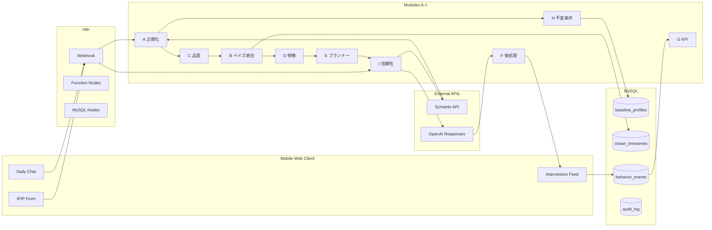

# Trait Flow MVP プロトタイプ仕様書

## 0. 背景
- 本プロトタイプは `requirements_AI_assistant` で定義された AI コーチングシステムの中核体験を最小構成で検証することを目的とし、`trait-flow-mvp` リポジトリで管理する。
- 正式版で要求される A〜I モジュールをベースに、ユーザー価値仮説検証と技術的成立性の確認に必要な機能のみを段階的に実装する。
- 対象利用者は日本語話者の個人ユーザー（バイリンガル対応は Stretch 目標）。デバイスはモバイル Web を第一優先とする。

## 1. 目的と成果指標
- **プロトタイプの目的**
  - Big Five を軸にしたパーソナライゼーションと日次介入がユーザーの気付き・行動変化を促すかを検証する。
  - Symanto API＋OpenAI Responses API を用いた自動ワークフローが実運用レベルの安定性で動作するかを確認する。
- **主要成果指標 (MVP 時点)**
  - オンボーディング完了率 ≥ 70%（IPIP-NEO-120 全問回答）
  - 日次チャット送信率 ≥ 40%（登録ユーザーのうち）
  - 介入カードの開封率 ≥ 60%、CTA 実行率 ≥ 20%
  - システム安定性: Symanto・OpenAI 呼び出し成功率 ≥ 95%、再試行による遅延 < 5 秒中央値

## 2. スコープ
- **MVP で実装する機能**
  - IPIP-NEO-120 ベースのオンボーディングとスコア正規化 (A)
  - Symanto Big Five/Communication Style の日次取り込みと正規化・品質推定 (A/C)
  - 単純ベイズ線形統合（precision-weighted average）の実装 (B)
  - EWMA と直近傾きに限定した特徴抽出 (D)
  - ルールベース (deterministic) の JITAI プランナー初期版 (E)
  - OpenAI Responses API を用いた介入メッセージ生成と最小限の後処理（Structured Outputs + Moderation + 長さ制御）(F)
  - 行動ログ・KPI の最小スキーマとダッシュボード用集計 (G)
  - データ不変条件（追記専用・値域チェック・権限分離）と基本的な監査ログ (H)
  - Symanto/OpenAI 呼び出しの再試行・サーキットブレーカ・レート制御（n8n ベースで実装）(I)
- **スコープ外（将来拡張）**
  - 多言語対応と高度な翻訳品質評価（現状は日本語のみ対応、英語は Stretch）
  - 強化学習/Contextual Bandit を用いたプランナー高度化（MVP はルールベース）
  - 変化点検知（CUSUM/BOCPD）の自動化、ドリフト検知の高度化
  - リッチなダッシュボード（MVP は簡易な表・グラフに留める）
  - モバイルアプリネイティブ実装（PWA で代替）

## 3. ユーザーフロー（MVP）
- **オンボーディング**
  1. ユーザーがモバイル Web でサインアップし、IPIP-NEO-120 を回答。
  2. n8n Webhook が回答を受信し、正規化モジュール (A) が T スコア / p01 を生成。
  3. ベースライン (`baseline_profiles`) に保存し、ベイズ Prior を初期化。
- **日次測定**
  1. ユーザーがチャット UI で日次リフレクションを入力。
  2. 言語判定（日本語のみ想定）→ Symanto API 呼び出し → Big Five/CS/PT を取得。
  3. 正規化 (A) と品質推定 (C) を適用し、Posterior 計算 (B) → `ocean_timeseries` に保存。
  4. EWMA/傾き (D) を計算し、プランナー (E) へコンテキストを渡す。
- **介入配信**
  1. プランナー (E) が Posterior・確信度・Sentiment をもとに介入テンプレートを決定。
  2. OpenAI Responses API でメッセージを生成し、Structured Outputs で整形・Moderation 実施 (F)。
  3. メッセージを UI/メール/Push（優先度順）で配信し、`behavior_events` に追記。
  4. KPI 集計 (G) と監査ログ保存 (H) を行う。

### 3.1 簡易アーキテクチャ図

## 4. モジュール別 MVP 仕様
- **A. 正規化**
  - IPIP-NEO-120 の採点ロジックを再利用。Symanto 出力は 0–1 を p01 として保存し、T スコアは線形近似 (T=100*p01) を初期値として使用。
  - `norm_version` を必須。欠損値は回答除外・Flag 付け（補完しない）。
- **B. ベイズ統合**
  - Prior（Baseline）と Likelihood（日次測定）を精度重み付きで統合。
  - 分散の下限を 0.02、上限を 0.25 に設定。Posterior μ/σ² を T/p01 両系で保存。
- **C. 確信度 / 品質**
  - トークン数、翻訳使用有無、Symanto レスポンス信頼度（提供される場合）で観測分散 σx² を調整。
  - 品質フラグ（`ok`, `short_text`, `symanto_error` など）を `text_personality_estimates` に保存。
- **D. 時系列特徴**
  - EWMA（α=0.3 固定）と直近 7 日の線形傾きを計算。
  - 傾きの有意性は閾値ベース（|slope| ≥ 0.1 でトレンド有り）。
- **E. 介入プランナー**
  - 3 種の介入テンプレートを用意（例：リフレクション、行動提案、セルフコンパッション）。
  - Posterior と Sentiment、品質フラグを条件に強度（軽・標準・強）と CTA を決定。
  - 低確信度（σ² > 0.2）時はリマインダー型の軽いメッセージを選択。
- **F. LLM 後処理**
  - OpenAI Responses API で JSON Schema を指定し、`{title, body, cta_text, cta_action}` を生成。
  - Moderation API を通過しない場合は定型メッセージにフォールバック。
  - 改行・リンク形式・XSS サニタイズを実施。
- **G. KPI**
  - `behavior_events` を基礎に、日次の開封率・CTA 実行率・連続記録日数を算出。
  - KPI は週次バッチ（n8n Scheduler）で集計し、CSV/Google Sheets へ出力。
- **H. 不変条件**
  - MySQL で CHECK 制約（p01: 0–1、T: 0–100）、UNIQUE(`idempotency_key`) を設定。
  - 追記専用テーブルについてはアプリ層で UPDATE/DELETE を禁止。
  - 監査ログ (`audit_log`) に外部 API 入出力とプロンプトを記録。
- **I. 信頼性制御**
  - Symanto/OpenAI 呼び出しは最大 3 回再試行、指数バックオフ (1s, 2s, 4s)。
  - HTTP 429/5xx/timeout のみ再試行対象。Retry-After を尊重。
  - サーキットブレーカ条件：連続 5 回失敗で 5 分間ブレーク。

## 5. データモデル（MVP スキーマ）
- `users`
  - `id`, `email`, `locale`, `created_at`
- `baseline_profiles`
  - `id`, `user_id`, `instrument`, `administered_at`, `ocean_T` (JSON), `ocean_p01` (JSON), `norm_version`, `raw_payload` (JSON), `created_at`
- `text_personality_estimates`
  - `id`, `user_id`, `message_id`, `observed_at`, `ocean_p01` (JSON), `ocean_T` (JSON), `sigma_x2` (JSON), `quality_flag`, `symanto_trace` (JSON), `created_at`
- `ocean_timeseries`
  - `id`, `user_id`, `observed_at`, `posterior_mu_T` (JSON), `posterior_mu_p01` (JSON), `posterior_sigma2` (JSON), `source` (`baseline`|`chat`), `created_at`
- `ocean_features`
  - `id`, `user_id`, `observed_at`, `ewma_T` (JSON), `slope_T` (JSON), `created_at`
- `intervention_plans`
  - `id`, `user_id`, `planned_at`, `template_id`, `intensity`, `inputs_snapshot` (JSON), `llm_output` (JSON), `moderation_result` (JSON)
- `behavior_events`
  - `id`, `user_id`, `event_type` (`delivered`|`opened`|`cta_clicked`), `intervention_id`, `occurred_at`, `idempotency_key`, `device_info` (JSON)
- `audit_log`
  - `id`, `event_time`, `source` (`symanto`|`openai`|`planner`), `request_payload` (JSON), `response_payload` (JSON), `status`, `latency_ms`

## 6. 外部サービス連携
- **Symanto API**
  - エンドポイント: `/big5`, `/communication_style`, `/personality_traits`
  - 認証: API Key（環境変数で管理）。n8n HTTP Request ノードに設定。
  - レート制限: 60 req/min を想定。n8n Token Bucket で 40 req/min にクリップ。
  - 障害時フォールバック: 直近 Posterior を再利用し、「最新データ未取得」メッセージを送信。
- **OpenAI Responses API**
  - モデル: `gpt-4.1-mini`（コストと品質のバランス）を想定。
  - Structured Outputs: 介入カードの JSON Schema を定義し、post-processing の負荷を削減。
  - 安全性: Moderation API→NG の場合は固有 ID の安全テンプレートへ置換。
  - コストガード: 1 日 50 ユーザー想定で平均 2 コール/日 → 月額概算を算出し、利用状況をメトリクスに記録。

## 7. 非機能要件
- **可用性**: 平日 8:00〜24:00 (JST) の稼働を保証。夜間は再試行ベースでバッチ処理のみ。
- **パフォーマンス**: 日次ワークフローは 30 秒以内に完了。介入生成は 10 秒以内を目標。
- **監査性**: すべての外部 API 呼び出しに対して `audit_log` へ request/response/latency を記録。
- **セキュリティ**: PII は最小限（email, locale）。行動ログとスコアを分離し、必要なら将来的に匿名化を追加。
- **障害対応**: 再試行失敗時は PagerDuty 等への通知（MVP は Slack Webhook で代用）。

## 8. 開発ロードマップ（参考）
1. **Phase 0: 設計と環境構築 (Week 1)**
   - n8n + MySQL（Docker Compose）環境を立ち上げ、API キー管理を整備。
   - テーブルスキーマとマイグレーションの骨組みを作成。
2. **Phase 1: オンボーディングフロー (Week 2)**
   - IPIP フォーム、正規化 (A)、ベイズ初期化 (B)、Baseline 保存 (H) を実装。
3. **Phase 2: 日次測定パイプライン (Weeks 3–4)**
   - Symanto 連携 (A/C/I)、Posterior 更新 (B)、特徴抽出 (D) を構築。
4. **Phase 3: 介入生成と配信 (Weeks 5–6)**
   - プランナー (E)、OpenAI 後処理 (F)、メッセージ配信と KPI ログ (G) を完成。
5. **Phase 4: 品質保証とパイロット (Weeks 7–8)**
   - エンドツーエンドテスト、10 名規模のパイロット、メトリクス監視を実施。

## 9. 開発体制とツール
- **開発体制**: 2〜3 名（ワークフロー/バックエンド 1、フロントエンド 1、ML/データ 0.5）
- **管理ツール**: GitHub Projects（タスク管理）、Linear/Notion（要件・ナレッジ）
- **監視**: n8n 内蔵メトリクス + Grafana Cloud（将来的に）／MVP は Slack 通知中心。

## 10. リスクと未決事項
- Symanto API の SLA が非公開のため、障害時のカバレッジに不確定要素がある → 代替 API の調査が必要。
- OpenAI のレスポンス品質が一定でない場合はルールベース生成のバックアップを検討。
- ユーザーデータ保護に関する法的確認（利用規約・プライバシーポリシー）が未整備。
- KPI 計測のためのイベント定義が追加検討中（CTA の種類、二次行動など）。

## 11. 参考資料
- `requirements_AI_assistant/README.md`
- `requirements_AI_assistant/docs/system_flow_playbook_ja.md`
- `requirements_AI_assistant/docs/specification/algorism/*.md`
- Symanto API 公式ドキュメント、OpenAI Responses API リファレンス、n8n ドキュメント

